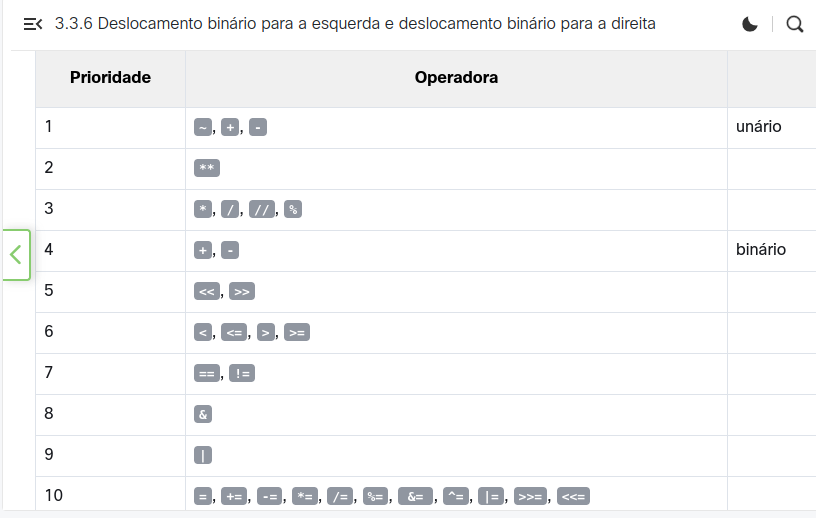
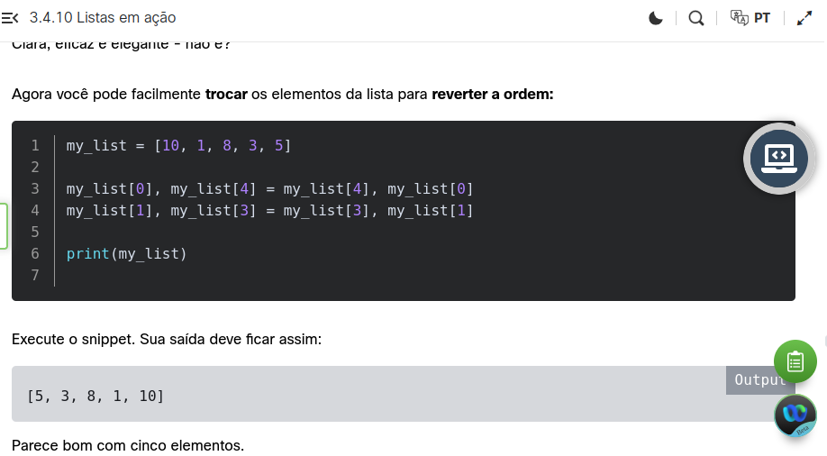

# Introdução

Eu colocarei anotações aqui de alguns tópicos que eu não achar tão óbvios do curso.


## Precedência:

```
P => ()
E => **
M => *
D => /
A => +
S => -
```



## Métodos de listas

Devo estar atento que posso fazer determinadas coisas em listas por métodos, como

```
a = [0,1,2]
a.append(3)
print(a) # [0,1,2,3]
```

E outras por palavras chave da linguagem:
```
del a[1]
print(a) # [0,2,3]
```

del a[1] pode ser chamado como função (= del(a[1]))

O método insert também insere, mas precisa da posição (PRECISA ser passado este argumento):
list.insert(location, value)

```
a = [1,3]
a.insert(1, 2)
print(a) # [1,2,3]
```

Atenção! O insert EMPURRA os demais valores, não sobrescreve. Reforçando:

```
my_list = []  # Criando uma lista vazia.
 
for i in range(5):
    my_list.insert(0, i + 1)
 
print(my_list) # [5,4,3,2,1]
```

Sobre a função range(), memorize que o comportamento dela difere dependendo do número de argumentos:

range(number) # cria uma lista de 0 até o número passado
range(start, stop) # cria uma lista de start a stop (veja o exemplo abaixo). stop NÃO deve ser incluído (só é incluído 1 inteiro antes)
range(start, stop, step) # cria uma lista de start a stop, pulando de step em step. stop NÃO deve ser incluído (só é incluído 1 inteiro antes)

```
>>> print(range(100)[99]) # lista com números de 0 a 99
99
>>> print(range(100, 101)[0]) # [100]
100
>>> print(range(100, 105, 2)[2]) # [100, 102, 104]
104
```

É interessante que é possível executar o comando abaixo:
range(-2)

Um número negativo como parâmetro. Mas isto dá erro:
range(-2)[0]

OBS: range(2)[0] retorna 0.

E range(-1), com um número negativo como parâmetro, dá erro


## Troca de valores entre variáveis

É possível fazer isto para trocar o valor de duas variáveis:
variable_1, variable_2 = variable_2, variable_1



Este script inverte a lista, mas por causa do break:

a = [0, 1, 2, 3, 4, 5]

```
for i in a:
    print(i)
    a[i] , a[len(a) - i - 1] = a[len(a) - i - 1], a[i]
    if i == 2:
        break

print(a)
```

Se não tiver o break, ele inverte e “desinverte” depois.


## del

del pode ser usado em listas ou em escalares:

```
a = 1
del a
print(a) # Erro !!

a = [0,1,2]
del a[1]
print(a) # [0,2]
```


## Ordenação pelo método bolha

O curso fala de ordenação pelo método bolha. Como eu lembro isto do curso técnico (que ocorreu há mais de 20 anos kkk), eu fiquei com vontade de implementar. Eu implementei [aqui](https://github.com/andreterceiro/bubble-sort-python).


## Listas copiadas por referência

As listas são copiadas por referência. O trecho abaixo retorna `[2]`

```
list_1 = [1]
list_2 = list_1
list_1 [0] = 2
print(list_2)
```

Mas podemos fazer uma copia dos valores e gerar uma nova lista, como no *snippet* abaixo:

```
list_1 = [1]
list_2 = list_1[:]
list_1[0] = 2
print(list_2)
```

Isto é chamado de **fatiamento** ou **slicing**.

Desta forma podemos copiar apenas parte de uma lista, como no *snippet* abaixo:

```
# Copiando parte da lista.
my_list = [10, 8, 6, 4, 2]
new_list = my_list [1 : 3]
print(new_list) # [8, 6]
```

O formato é `[start: end]`, mas **end** é o primeiro elemento **não** incluso, como você pode deduzir do código acima.

No fatiamento podemos até trabalhar com números negativos. Números negativos fazem a contagem de elementos da lista de trás para frente. **-1** refere-se ao último elemento, mas lembre-se, **o último elemento não é incluído no retorno.**

Exemplos:

```
my_list = [10, 8, 6, 4, 2]
new_list = my_list[1:-1]
print(new_list) # [8, 6, 4]

my_list = [10, 8, 6, 4, 2]
new_list = my_list[-3:-1]
print(new_list) # [6, 4]
```

Mas como então falo que quero o **último** elemento de uma lista?

Bem, o último elemento no fatiamento pode ser omitido:

```
my_list = [10, 8, 6, 4, 2]
new_list = my_list[1:]
print(new_list) # [8, 6, 4, 2]
```

Podemos omitir também o índice de início do fatiamento. Veja:

```
my_list = [10, 8, 6, 4, 2]
new_list = my_list[:2]
print(new_list) # [10, 8]
```

Veja que da mesma forma que quando queremos retornar o último elemento e ocultamos o final no fatiamento (veja 2 exemplos de código acima), se ocultarmos o início do fatiamento, ele começa a retornar a partir do primeiro elemento.

**del** também pode ser feito em fatias. Lembre-se que o **índice final de fatiamento não é correspondente ao último índice excluído, e sim ele -1**. Veja:

```
my_list = [10, 8, 6, 4, 2]
del my_list[1:3]
print(my_list) # retorna [10, 4, 2]
```

Uma nova lista **não** é gerada!

Como esperado, `[:]` exclui todos elementos da lista:

```
lst = [1,2,3]
del lst [:] # list agora será igual a []
print(lst) # retorna []
del lst # assim eu excluo a lista e não seus elementos
print(lst) # Erro!
```


## in e not in em listas

```
my_list = [0, 3, 12, 8, 2]

print(5 in my_list)
print(5 not in my_list)
print(12 in my_list)

# Retorna
# False
# True
# True
```


# Falando um pouco sobre o "for"

O básico de uma iteração com **"for"** é:

```
lista = [4,5,6]
for elemento in lista:
    print(elemento)
```

Imprime:

4
5
6

Com **enumerate(lista)** conseguimos ter acesso ao **índice** em um loop semelhante, veja:

```
lista = [4,5,6]
for idx, elemento in enumerate(lista):
    print(str(idx) + ": " + str(elemento))
```

Imprime:

0: 4
1: 5
2: 6

Curiosidade, veja o *snippet* abaixo:

```
lista = [4,5,6]
print(enumerate(lista))
```

Retorna por exemplo:

<enumerate object at 0x7f41f1211500>

**Atenção:** não se pode fazer:

```
lista = [4,5,6]
print(enumerate(lista))
print(enumerate[0]) # Erro!!!!!!!!!!!!!
```

Lembre-se que a função, por exemplo com os parâmetros start e stop, retorna:

```
lista = range(4, 7)
print(lista) # retorna range(4, 7)
print(lista[0]) # retorna 4 - primeiro elemento
print(lista[-1]) # retorna 6 - último elemento
```

De vez em quando vemos um `for` com um `range`. Funciona como o esperado:

```
lista = range(4, 7)
for elemento in lista:
    print(elemento)

# Imprime
# 4
# 5
# 6
```


## Mais sobre fatiamento

Lembre-se que no fatiamento trabalhamos com os **índices**, logo `lst[1]` refere-se ao segundo elemento de uma lista. Para mostrar todos elementos da lista devemos começar no 0.

```
my_list = [17, 3, 11, 5, 1, 9, 7, 15, 13]
 
for i in my_list[0:]:
    print(i)
```

Imprime:
17
3
11
5
1
9
7
15
13


# del em listas apontando para o mesmo lugar

Veja que quando excluímos uma lista, na verdade estamos excluindo o apontamento para ela. Ou seja, se existirem demais apontamentos para a lista, eles poderão continuar vendo a lista **mesmo que o primeiro apotamento seja removido**:

```
list_1 = ["A", "B", "C"]
list_2 = list_1
list_3 = list_2
 
del list_2[0]
del list_1
 
print(list_3) # Imprime [B, C]
```


# Compreensão de listas

```
row = ["banana" for i in range(8)]
print(row)

# Imprime:
['banana', 'banana', 'banana', 'banana', 'banana', 'banana', 'banana', 'banana']

# Lembre-se, range(8) retorna um range, mas semelhante a um array indo de 0 a 7
```


## Arrays multidimensionais com for ... in ...

Python tem uma sintaxe estranha para criar um array multidimensional com `for ... in ...`:

```
row = [["banana" for i in range(8)] for j in range(6)]
   
print(row)

# Imprime:
# [
#     ['banana', 'banana', 'banana', 'banana', 'banana', 'banana', 'banana', 'banana'], 
#     ['banana', 'banana', 'banana', 'banana', 'banana', 'banana', 'banana', 'banana'], 
#     ['banana', 'banana', 'banana', 'banana', 'banana', 'banana', 'banana', 'banana'], 
#     ['banana', 'banana', 'banana', 'banana', 'banana', 'banana', 'banana', 'banana'], 
#     ['banana', 'banana', 'banana', 'banana', 'banana', 'banana', 'banana', 'banana'], 
#     ['banana', 'banana', 'banana', 'banana', 'banana', 'banana', 'banana', 'banana'], 
# ]
```

Imprime em uma única linha, só formatei assim para facilitar a visualização. Veja, acima temos 8 elementos dentro de cada linha e 6 linhas, não confundir.


## For ... else

Como último "suspiro" de uma iteração, podemos colocar nela um bloco "`else`":

```
for element in range(0,3):
    print(element)
else:
    print("final")
```

Imprime:
0
1
2
final


## Funções


### Parâmetros


#### Geral

Quanto aos parâmetros, sem "novidades":

- Pode existir um valor padrão;
- Argumentos sem valor padrão devem vir no final;

```
def message(text2, text1="123"):
    print(text1, text2)

message("456")

# Imprime:
# 123 456
```


#### Passando o nome de um parâmetro


```
def introduction(first_name, last_name):
    print("Olá meu nome é", first_name, last_name)
 
introduction(first_name = "James", last_name = "Bond")
introduction(last_name = "Skywalker", first_name = "Luke")
```

Isto imprime:

```
Olá meu nome é James Bond
Olá meu nome é Luke Skywalker
```


#### Misturando keyword com positional arguments:

Podemos fazer testes estranhos (kkk):

```
def adding(a, b, c):
    print(a, "+", b, "+", c, "=", a + b + c)

adding(1, 2, 3) # Obviamente funciona, imprime '1+2+3=6'
adding(1, c=2, b=3) # Obviamente funciona, imprime '1+3+2=6'
adding(1, b=2) # Não funciona, pois falta o parâmetro 'c'
adding(a=2, b=3, 1) # Não funciona, pois o positional argument deve vir primeiro que o keyword argument
adding(2, 3, a=1) # Não funciona, pois temos múltiplos valores para 'a'
adding(2, 3, a=1, c=4) # Não funciona, pois temos múltiplos valores para 'a'
adding(2, 3, 4, d=5) # Não funciona, pois só temos 3 parâmetros
adding(1, 2, 3, 4) # Não funciona, pois só temos 3 parâmetros
```

** Um detalhe é que o `positional argument` deve vir antes do `keyword argument` 

Na declaração de funções, os argumentos com um valor padrão devem vir depois dos arqumentos sem um valor padrão.

```
# Não funciona, um argumento com valor padrão está vindo antes de um argumento sem um valor padrão
def soma(a=1, b):
    return a + b

# Pode não ter nada errado na declaração da função HIPOTETICAMENTE, mas chamá-la assim não funciona
adding(a=2, b=3, 1) # Não funciona, pois o positional argument deve vir primeiro que o keyword argument
```


## Curiosidades sobre o None

None não pode ser somado a nada, nem a None mesmo.

Se uma função explicitamente não retornar nada, ela retornará None por padrão.


## Escopo

Veja que código interessante:

```
def my_function():
    print("Eu conheço aquela variável?", var)

var = 1
my_function()
print(var)
```

É impresso "Eu conheço aquela variável?, 1". Ou seja, eu consigo acessar váriáveis externas a uma função dentro de uma função. Vou testar o inverso:

```
def my_function():
    var = 1
    print("Oi")

my_function()
print(var)
```

Erro, ou seja, o inverso não é verdadeiro, no escopo global eu não posso acessar uma variável declarada dentro de uma função.

Vamos testar se conseguimos alterar uma variável do escopo global por dentro de uma função:


```
def my_function():
    var = 2
    print("Oi", var)

var = 1
my_function()
print(var)
```

Não, o valor não é alterado no escopo global... Mas no escopo da função é sim, tanto que a linha

```
print("Oi", var)
```

Imprimiu "Oi 2", mas o `print(var)` do final, após a alteração dentro do escopo da função, imprimiu 1.

E se eu imprimir o valor antes da variável ser alterada, algo como:

```
def my_function():
    print("Oi", var)
    var = 2
    print("Oi", var)

var = 1
my_function()
print(var)
```

Isto gerará um erro de que a variável foi usada antes de ser declarada.


## Palavra chave 'global'

Vamos modificar um pouco o *snippet* anterior:

```
def my_function():
    global var
    print("Oi", var)
    var = 2
    print("Oi", var)

var = 1
my_function()
print(var)
```

Nenhum erro ocorre e eu consegui alterar a variável global. A saída é:

```
Oi 1
Oi 2
2
```


## Posso alterar uma variável passada como argumento?

Veja o código abaixo:

```
def my_function(n):
    print("Eu obtive", n)
    n += 1
    print("Eu tenho", n)

var = 1
my_function(var)
print(var)
```

A saída é:

```
Eu obtive 1
Eu tenho 2
1
```

Era o comportamento que se esperava, mas é importante reforçar kkk.

Mas veja que não é tão simples:

```
def my_function(my_list_1):
    print("Print #1:", my_list_1)
    print("Print #2:", my_list_2)
    del my_list_1[0] # Pay attention to this line.
    print("Print #3:", my_list_1)
    print("Print #4:", my_list_2)

my_list_2 = [2, 3]
my_function(my_list_2)
print("Print #5:", my_list_2)
```

A saída é:

```
Print #1: [2, 3]
Print #2: [2, 3]
Print #3: [3]
Print #4: [3]
Print #5: [3]
```

Neste caso eu alterei sim a variável passada como parâmetro.

E se eu adcionar um valor à lista?

```
def my_function(my_list_1):
    print("Print #1:", my_list_1)
    print("Print #2:", my_list_2)
    my_list_2.append(3)
    print("Print #3:", my_list_1)
    print("Print #4:", my_list_2)

my_list_2 = [2, 3]
my_function(my_list_2)
print("Print #5:", my_list_2)
```

Mesma coisa, alterei uma variável do escopo global, veja:

```
Print #1: [2, 3]
Print #2: [2, 3]
Print #3: [2, 3, 3]
Print #4: [2, 3, 3]
Print #5: [2, 3, 3]
```

E em relação a alterar 1 item?

```
def my_function(my_list_1):
    print("Print #1:", my_list_1)
    print("Print #2:", my_list_2)
    my_list_1[0] = 99
    print("Print #3:", my_list_1)
    print("Print #4:", my_list_2)

my_list_2 = [2, 3]
my_function(my_list_2)
print("Print #5:", my_list_2)
```

Mesma coisa, consegui alterar o conteúdo de uma variável que está no escopo global, veja a saída:

```
Print #1: [2, 3]
Print #2: [2, 3]
Print #3: [99, 3]
Print #4: [99, 3]
Print #5: [99, 3]
```

Vamos fazer um teste com uma lista que não seja passada como parâmetro:

```
def my_function():
    print("Print #1:", my_list_2)
    my_list_2[0] = 98
    my_list_2.append(99)
    del my_list_2[1]
    print("Print #2:", my_list_2)

my_list_2 = [2, 3]
my_function()
print("Print #3:", my_list_2)
```

Saída:

```
Print #1: [2, 3]
Print #2: [98, 99]
Print #3: [98, 99]
```

Ou seja, eu altero uma lista, que não é um escalar, do escopo global, passada como parâmetro ou não, se eu excluir, adicionar ou alterar um item da lista, mas se eu modificar a lista como um todo, simplesmente é mudado o apontamento. É o mesmo comportamento de eu ter 2 listas no escopo global e alterar uma, veja:

```
my_list_1 = [0,1,2]
my_list_2 = my_list_1
my_list_2[0] = 99
print(my_list_1)
print(my_list_2)
my_list_2 = "banana"
print(my_list_1)
print(my_list_2)
```

Saída:

```
[99, 1, 2]
[99, 1, 2]
[99, 1, 2]
banana
```

Ou seja, se eu alterar 1 item, altero de todas as varíaveis que tem o apontamento para a mesma lista, mas se eu alterar o **conteúdo todo** da variável, o apontamento novo muda, mas o antigo continua apontando para a mesma lista.


## Diversos

Criei a função abaixo para calcular um fatorial (em menos de 3 minutos kkk):

```
def factorial(number):
    if n < 0:
        return None
    if n < 2:
        return 1

    total = 1
    while number > 1:
        total *= number
        number = number - 1

    return total
```

Testei com números aleatórios e deu certo :)

Fiz uma função sem muito cuidado de otimização, rascunhão, rapidão, para calcular o *Fibonacci* de um número até 100, usando um "listão" que poderia com certeza ser otimizado:

```
def fib(n):
    i = 0
    numbers = []
    if n > 100:
        raise Exception("O número precisa ser menor que 100")

    while i <= 101:
        if i == 0 or i == 1:
             numbers.append(1)
        else:
            numbers.append(numbers[i - 1] + numbers[i - 2])

        if i - 1 == n:
            return numbers[i]
        
        i += 1

print(fib(100))
```

Uma coisa interessante que reparei é que não é como PHP onde eu posso informar um índice que ainda não foi criado. Eu preciso primeiro inserir um valor na posição para usa-la, logo:

```
a = [0, 1]
a.append(2)
print(a)

a[3] = 3 # Dá erro, pois ainda não existe nada nesta posição da lista
         # Eu preciso primeiro fazer por exemplo um insert ou um append 
```

Uma versão mais otimizada e genérica para o *Fibonacci* seria:

```
def fib(n):
    if n < 1:
        return None
    if n < 3:
        return 1
    return fib(n - 1) + fib(n - 2)
```

E uma versão recursiva e mais enxuta para o fatorial seria por exemplo:

```
def factorial_function(n):
    if n < 0:
        return None
    if n < 2:
        return 1
    return n * factorial_function(n - 1)
```


## Tuplas

Uma tupla não tem o método append():

```
a = [0, 1]
a.append(2)
print(a) # imprime [0, 1, 2]
a = (0, 1)
a.append(2) # Erro !
print(a)
```

Posso criar uma tupla sem colocar os parênteses:

```
a = 0, 1
print(a) # imprime (0, 1)
```

Parece meio bizarro, mas para se criar uma tupla com um único elemento deve se colocar uma vírgula no final, veja:

```
a = (0)
print(a) # Imprime 0
print(a == 0) # Imprime True

a = (0,) 
print(a) # Imprime (0,)
print(a == 0) # Imprime False
```

E como eu crio uma tupla de um único elemento sem parênteses? Da mesma forma!

```
a = 0, 
print(a) # Imprime (0,)
print(a == 0) # Imprime False
print (type(a)) # Imprime <class 'tuple'>
```

Verificações de determinados operadores em tuplas:

```
my_tuple = (1, 10, 100)

t1 = my_tuple + (1000, 10000)
t2 = my_tuple * 3

print(len(t2)) # Imprime 9
print(t1) # Imprime [1, 10, 100, 1000, 10000]
print(t2) # Imprime [1, 10, 100, 1, 10, 100, 1, 10, 100]
print(10 in my_tuple) # Imprime True
print(-10 not in my_tuple) # Imprime True
```

Veja que usar os operadores de soma e multiplicação funciona da mesma forma com listas:

```
print([0,1] + [0,1])
print([0,1] * 3)
```

Lembre-se, não podemos incluir mais um item na tupla, mas podemos trocar a variável da tupla como um todo:

```
a = (0, 1)
b = (2, 3)

a, b = b, a

print(a, b) # Imprime (2, 3) (0, 1)

b = 4

print(a, b) # Imprime (2, 3) 4
```


## Dicionários

Chaves podem ser inteiros ou floats:

```
a = {1: "um", "um": 1, 1.1: "un ponto um"}
print(a)
print(a[1]) # Imprime "um"
print(a['um']) # Imprime 1
print(a[1.1]) # Imprime "um ponto um"
print(a['1']) # Key error
```

Não podemos iterar diretamente em um dicionário, mas podemos usar o método `keys()`:

```
dictionary = {"gato": "chat", "cachorro": "chien", "cavalo": "cheval"}
 
for key in dictionary.keys():
    print(key, "->", dictionary[key])

# Imprime
# gato -> chat
# cachorro -> chien
# cavalo -> cheval
```

Também temos o método `items()`:

```
dictionary = {"cat": "chat", "dog": "chien", "horse": "cheval"}
 
for english, french in dictionary.items():
    print(english, "->", french)

# Imprime
# cat -> chat
# dog -> chien
# horse -> cheval
```

Podemos através deste método ter acesso à chave e ao valor.

Existe também o método `values()`:

```
dictionary = {"gato": "chat", "cachorro": "chien", "cavalo": "cheval"}
 
for french in dictionary.values():
    print(french)

# Imprime
# chat
# chien
# cheval
```

Existe uma função (**não é um método**) sorted estranha, que, bem, ordena (kkkk) os valores de um dicionário e os retorna em uma lista:

```
dictionary = {"gato": "chat", "cachorro": "chien", "cavalo": "cheval"}
 
print(dictionary)
print(sorted(dictionary))
print(type(sorted(dictionary)))

# Imprime
# {'gato': 'chat', 'cachorro': 'chien', 'cavalo': 'cheval'}
# ['cachorro', 'cavalo', 'gato']
# <class 'list'>
```

Veja o *snippet* abaixo. Podemos adicionar um valor novo a um dicionário citando uma chave nova, **lembre-se que isto não funciona para listas. Em listas temos que usar métodos como insert() ou append()**:

```
dictionary = {"gato": "chat", "cachorro": "chien", "cavalo": "cheval"}
 
dictionary['cisne'] = 'swan'
print(dictionary)

# Imprime
# {'gato': 'chat', 'cachorro': 'chien', 'cavalo': 'cheval', 'swan': 'cygne'}
```

Vamos abaixo relembrar a keyword `del` aplicada a listas e mostrar o funcionamento em dicionários:

```
dictionary = {"gato": "chat", "cachorro": "chien", "cavalo": "cheval"}
 
del dictionary['cachorro']
print(dictionary) # Imprime {'gato': 'chat', 'cavalo': 'cheval'}
 
lst = [1,2,3,4]

del lst[2]

print(lst) # Imprime [1, 2, 4]
```

No caso de listas e dicionários, temos que especificar a chave. Mas no caso de listas podemos ter indicado a chave (por exemplo com o método insert(chave, valor)) ou não (por exemplo com o metodo append(valor)).

Veja que uso interessante do `range()` para ver se um número está em um intervalo:

```
school_class = {}

while True:
    name = input("Digite o nome do aluno: ")
    if name == '':
        break
 
    score = int(input("Insira a pontuação do aluno (0-10): "))
    if score not in range(0, 11):
        break
 
    if name in school_class:
        school_class[name] += (score,)
    else:
        school_class[name] = (score,)
 
    for name in sorted(school_class.keys()):
        adding = 0
        counter = 0
        for score in school_class[name]:
            adding += score
            counter += 1
        print(name, ":", adding / counter)
```


## Comentários diversos

Pode-se criar uma tupla com a função `tuple()`:

```
a = [1, 2]
b = tuple(a)
print(type(b)) # <class 'tuple'>
print(b) # (1, 2)
```

Existe também a função `list()`, de finalidade óbvia e semelhante à `tuple()`

Desde o Python 3.6x os dicionários passaram a ser ordenados por padrão.

Dicionários tem o método `get()`:

```
pol_eng_dictionary = {
    "kwiat": "flor",
    "woda": "água",
    "gleba": "solo"
    }
 
item_1 = pol_eng_dictionary["gleba"] # ex. 1
print(item_1) # saídas: solo
 
item_2 = pol_eng_dictionary.get("woda") # ex. 2
print(item_2) # saídas: água
```

Mas podemos obter os dados no formato `dicionario[chave]` como fazemos no caso de listas ou tuplas.

Podemos usar os métodos `update()` para inserir ou atualizar um item e o método `popitem()` para excluir um item.

```
pol_eng_dictionary = {"kwiat": "flor"}
 
pol_eng_dictionary.update({"gleba": "banana"})
pol_eng_dictionary.update({"gleba": "solo"})
print(pol_eng_dictionary) # saídas: {'kwiat': 'flor', 'gleba': 'solo'}
 
pol_eng_dictionary.popitem()
print(pol_eng_dictionary) # saídas: {'kwiat': 'flor'}
```

Podemos usar o método `items()` para ter acesso aos itens em uma iteração "for":

```
pol_eng_dictionary = {
    "zamek": "castelo",
    "woda": "água",
    "gleba": "solo"
    }
 
for key, value in pol_eng_dictionary.items():
    print("Pol/Eng ->", key, ":", value)

# Imprime
# Pol/Eng -> zamek : castelo
# Pol/Eng -> woda : água
# Pol/Eng -> gleba : solo
```

Uma iteração "normal" envolvendo dicionários **dá acesso aos índices e não aos valores**:
```
pol_eng_dictionary = {
    "zamek": "castelo",
    "woda": "água",
    "gleba": "solo"
    }
 
for key in pol_eng_dictionary:
    print("Pol/Eng ->", key)

# Imprime
# Pol/Eng -> zamek
# Pol/Eng -> woda
# Pol/Eng -> gleba
```

Quando usamos `in` em um dicionário, ele estará relacionado às **chaves**:

```
pol_eng_dictionary = {
    "zamek": "castelo",
    "woda": "água",
    "gleba": "solo"
    }
 
if "zamek" in pol_eng_dictionary:
   print("Sim")
else:
   print("Não")

if "solo" in pol_eng_dictionary:
   print("Sim")
else:
   print("Não")

# Imprime
# Sim
# Não
```

Podemos usar o método `clear()` para apagar **todos** os itens de um dicionário:

```
pol_eng_dictionary = {
    "zamek": "castelo",
    "woda": "água",
    "gleba": "solo"
    }
 
print(len(pol_eng_dictionary)) # saídas: 3
del pol_eng_dictionary["zamek"] # remover um item
print(len(pol_eng_dictionary)) # saídas: 2
 
pol_eng_dictionary.clear() # remove todos os itens
print(len(pol_eng_dictionary)) # saídas: 0
 
del pol_eng_dictionary # remove o dicionário
```

Existe também o método `copy()`:

```
pol_eng_dictionary = {
    "zamek": "castelo",
    "woda": "água",
    "gleba": "solo"
    }
 
copy_dictionary = pol_eng_dictionary.copy()
```

## Diversos

Veja que forma interessante de fazer o desempacotamento de uma tupla:

```
tup = 1, 2, 3
a, b, c = tup
 
print(a * b * c) # Imprime 6
```

Podemos usar o **método** `count()` para contar o número de ocorrências de um valor em uma tupla:

```
tup = 1, 2, 3, 2, 4, 5, 6, 2, 7, 2, 8, 9
ocurrences = tup.count(2)

print(ocurrences) # saída: 4
```

Este método também existe em listas e funciona da mesta forma, mas não em dicionários.

Para transformar uma tupla (por exemplo) em um dicionário existe a função `dict()`:

```
print(
    dict(
        (
            ("idade",42), 
            ("nome", "André")
        )
    )
)

# Saída:
# {'idade': 42, 'nome': 'André'}
```

A tupla precisa ser uma tupla com tuplas de 2 elementos. Se colocar 3, como abaixo, ou até 1 ou 4,ocorre um erro:

```
print(
    dict(
        (
            ("idade", 42, 42), 
            ("nome", "André")
        )
    )
)
```


## Exceções

```
try:
    1/0
except ZeroDivisionError:
    print("Exception")
finally:
    print("Finally")

try:
    raise ValueError("erro")
except ZeroDivisionError:
    print("Exception")
finally:
    print("Finally")

# Saída
# Exception
# Finally
# Finally
# Traceback (most recent call last):
#   File "/srv/www/raiz/python/data-analysis-python-senai-course/teste.py", line 9, in <module>
#   raise ValueError("erro")
# ValueError: erro
```

Outra coisa que pode ser vista no trecho acima é que é posso lançar uma exceção com o `raise`.

[Esta aula](https://www.netacad.com/launch?id=ea83e02f-1c92-484b-bb2a-81f274fb44e8&tab=curriculum&view=715e4004-5394-58a2-8279-c1af23b595d3) comenta um pouco sobre algumas exceções e quando usar.


Algumas formas de forçar o lançamento de uma exceção:

- Dividindo por zero (ZeroDivisionError);
- Usando um método que não existe (AttribueError). Como `short_list.depend(3)`. Podemos tratar este erro e seguir o fluxo do programa, veja:

```
try:
    short_list = [1]
    short_list.append(2)
    print(short_list)
    short_list.append(3)
    short_list.depend(4)
except Exception:
    print("Exception !")

print(short_list)

# Saída:
# [1, 2]
# Exception !
# [1, 2, 3]
```

- Usando um índice de ponto flutuante (TypeError):

```
list = [1,2]
print(list[0.5])

# Saída:
# Traceback (most recent call last):
#   File "/srv/www/raiz/python/data-analysis-python-senai-course/teste.py", line 2, in <module>
#     print(list[0.5])
# TypeError: list indices must be integers or slices, not float

# Tataríamos esta exceção por exempĺo assim:
# try:
#     list = [1,2]
#     print(list[0.5])
# except Exception:
#     print((list[0]))
#
# Saída
# 1
```

Não consegui tratar um Syntax error nem colocando `SyntaxError` ou colocando `Exception` para tentar capturar uma exceção. Veja que abaixo abri colchetes e fechei com uma chave:

```
try:
    list = [1,2}
    print(list[0.5])
except SyntaxError:
    print("Aqui !!")

# Saída:
# File "/srv/www/raiz/python/data-analysis-python-senai-course/teste.py", line 2
#   list = [1,2}]
#              ^
# SyntaxError: closing parenthesis '}' does not match opening parenthesis '['
```

Este comportamento é interessante, vejamos o funcionamento neste código que gera um `NameError` quando o usuário insere um valor negativo:

```
temperature = float(input('Digite a temperatura atual:'))

try:
    if temperature > 0:
        print("Acima de zero")
    elif temperature < 0:
        prin("Abaixo de zero")
    else:
        print("Zero")
except NameError:
    print("Exception !!")

# Saída "normal se o usuário digitar um valor maior ou igual a zero
# Se o usuário digitar um vaor negativo a saída é 'Exception !!', ou seja, eu consigo tratar este NameError.
```

Podemos testar com um SyntaxError do exemplo anterior:

```
temperature = float(input('Digite a temperatura atual:'))
a = [1, 2]

try:
    if temperature > 0:
        a.append(3)
    elif temperature < 0:
        a.append(4}
    else:
        a.append(5)
except SyntaxError:
    print("Exception !!")
finally:
    print(a)
```

Não se importe com o fato de existir um input e uma variável a separados, entenda apenas que a saída ao executar o programa é a abaixo já ao executar este programa, ou seja, eu não consigo tratar este erro da forma que fiz acima:

```
  File "/srv/www/raiz/python/data-analysis-python-senai-course/teste.py", line 8
    a.append(4}
              ^
SyntaxError: closing parenthesis '}' does not match opening parenthesis '('
```

Sobre [capturar um syntax error](https://stackoverflow.com/questions/25049498/failed-to-catch-syntax-error-python).


## IDLE

IDLE = Integrated Development and Learning Environment.

[Link](https://docs.python.org/3/library/idle.html)

Com esta IDLE dá para depurar o código mais facilmente, veja [estes printscreens](https://www.cs.uky.edu/~keen/help/debug-tutorial/debug.html).


## Pytest

Veja [a documentação](https://docs.pytest.org/en/stable/getting-started.html) para lembrar se esquecer. A instalação é simples com o `pip`. E executando o comando abaixo, obviamente (não esqueça !!!) executamos um teste com o `pytest`:

```
pytest hello_world_pytest.py
```